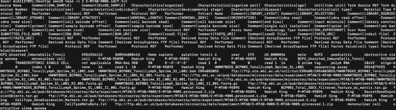
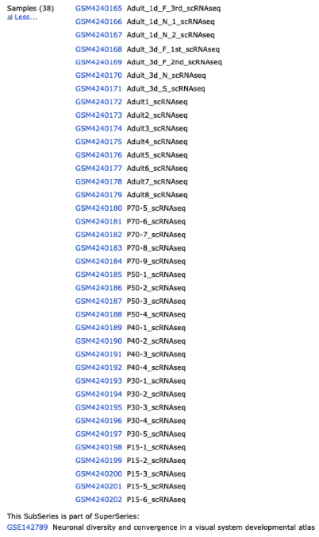
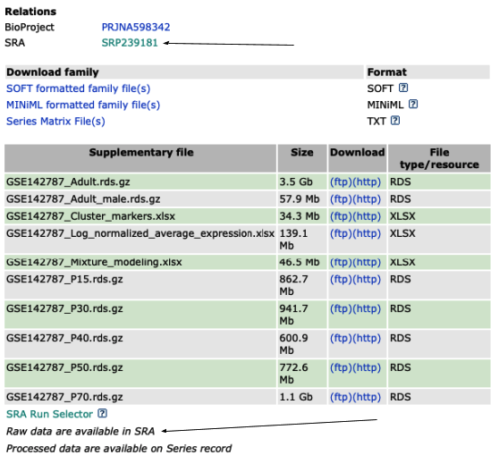
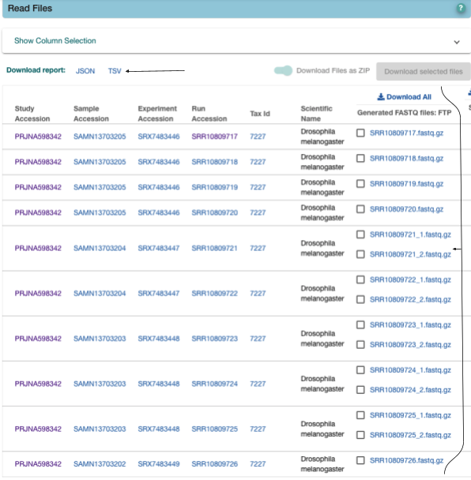
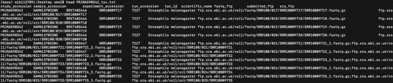
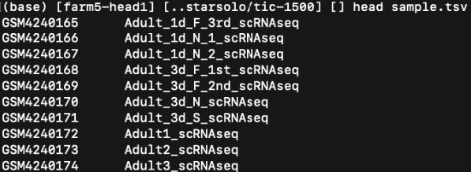

# Getting Fastqs
Scripts to help get fastqs

## Array Express
Array Express data starts with `E-MTAB-` i.e. `E-MTAB-9005`. Go to the [ArrayExpress Website](https://www.ebi.ac.uk/arrayexpress/) and search with the ID. You will arrive at a project page containing information about samples, protocols, organisms etc. You want to download the sdrf.txt file.


The downloaded file will look something like this:



You need to obtain all the fastq files. This can be done with the script `arrayexpr_urls.sh`

```bash
./arrayexpr_urls.sh sdrf.txt > urls.txt
```

This command converts each tab to a new line using `tr ‘\t’ ‘\n’`

The command then grabs every ftp file with `grep ftp`

The command then grabs every fastq file with `grep “fastq.gz”`

The command then grabs only the R1 and R2 fastq files with `egrep "_R1_|_R2_"`

Each fastq then needs to be downloaded which can be done using the script `get_arrayexp.sh`

```bash
./get_arrayexp.sh urls.txt
```

This command downloads the fastq `wget $i`

This command manipulates url to get value after final slash (fastq ID) `j=basename $i`

This command removes the fastq extension from `basename k=${j%%.fastq.gz}`

This command outputs logs of wget to file with ID in name `-o $k.wget.log`

## GSE

If data is not available on array express, go to [NCBI website](https://www.ncbi.nlm.nih.gov) and search for the project. Firstly, check the list of samples to ensure all data is 10x. The sample list will look like this:



Next, you want to ensure the raw data is available in SRA. If it is not available, due to confidentiality reasons then we cannot help as we do not have the permissions to request data.



Take the SRA ID starting `PRJNA` and search the [ENA website](https://www.ebi.ac.uk/ena/browser/home). The resulting page will display all the samples with their fastq files. If only paired-end fastq files are present (`fastq_1`, `fastq_2`) then download tsv report. 



The downloaded tsv report looks like this:



To download the fastqs, use the script `gse_url.sh`:

```bash
./gse_url.sh PRJNA598342_tsv.txt
```

This command downloads the fastq `wget $i`

This command manipulates url to get value after final slash (fastq ID) `j=basename $i`

This command removes the fastq extension from basename `k=${j%%.fastq.gz}`

This command outputs logs of wget to file with ID in name `-o $k.wget.log`

If only one fastq is present, single end, then more work needs to be done.

Firstly, check the `srapath` of a single sample ID. To do this you need to either install [sra tools](https://github.com/ncbi/sra-tools/wiki/02.-Installing-SRA-Toolkit). To check the `srapath` do the following with one of your samples:

```bash
srapath SRR10809717
```

If the output looks like this:

```bash
https://sra-pub-run-odp.s3.amazonaws.com/sra/SRR10809717/SRR10809717
```

Then you can download all SRRs using this URL format as only the basename of the URL changes, the rest remains identical, using the script `srapath_urls.sh`

```bash
./srapath_urls.sh PRJNA598342_tsv.txt
```

This command downloads the SRR `wget https://sra-pub-run-odp.s3.amazonaws.com/sra/$i/$i`

This command outputs logs of wget to file with ID in name `-o $i.wget.log`

If the `srapath` output looks like this:

```bash
https://trace.ncbi.nlm.nih.gov/Traces/sdlr/sdlr.fcgi?jwt=eyJhbGciOiJSUzI1NiIsImtpZCI6InNkbHJraWQxIiwidHlwIjoiSldUIn0.eyJhY2MiOiJTUlIxMzc2NDg0OSIsImV4cCI6MTY1MDk4MTAwNSwiZmlsZVNpemUiOiIxNTAyNDM1OTAwIiwiaWF0IjoxNjUwOTY2NjA1LCJpZ25vcmVDZSI6InRydWUiLCJqdGkiOiJjMTFjNWQyZS00YWVmLTRkMzYtYTZmYS03OTZhYmRlNjBiMDIiLCJsaW5rIjoiaHR0cHM6Ly9zcmEtZG93bmxvYWRiLmJlLW1kLm5jYmkubmxtLm5paC5nb3Yvc29zNC9zcmEtcHViLWh1cC0xL1NSUjAxMy8xMzc2NC9TUlIxMzc2NDg0OS9TUlIxMzc2NDg0OS4xP25jYmlfcGhpZD0zMjJDMDU2QTYzRjdDRDY1MDAwMDREQjY1MTRDMkUzNi4xLjEiLCJyZWdpb24iOiJiZS1tZCIsInNlcnZpY2UiOiJzcmEtc29zIiwic2lnbmluZ0FjY291bnQiOiJ0cmFjZV9yLmJlbWQiLCJ0aW1lb3V0IjoxNDQwMH0.Uq7XLShbEewwA6dAnAOOWXsNCS3FNoAlRSwJr_xP_MF7TNVRpcMtpbFSoAO2QkYddqIy7B3nUGjh2dh4IQOj4gyJ-XEtJ5IuHcXq8b3UFnlBNpt2rV6apUwj5RoNYhJkP125PTrpRCdu3wpA3rciQPEMiU8GMnEV5ryLkdBA6tKTQHEnTM1ZkeNXaHeks7I8XbmT0MbAsSy4pIOkfzio9QKImYZMU4CVJ-yl5xpONLvWiQqLNaKmhg_CFwWr3DsuCw2yTcLKwsesz6okjdLLNt0DLATgAHxbAmok3i8QFNkZmscujoepMyQNovuULWSoh1CzhxvkgtJjkmuLWykSEg
```

This means srapath has failed and you need to download the SRRs using the ftp link in the tsv report. Use the script `srr_urls.sh`:

```bash
./srr_urls.sh PRJNA598342_tsv.txt
```

This command downloads the SRR `wget $i`

This command manipulates url to get value after final slash (SRR ID) `j=basename $i`

This command outputs logs of wget to file with ID in name `-o $j.wget.log`

Now you have downloaded  all of the SRRs.

Next you need to extract the fastqs from the SRRs. I suggest moving all the SRRs to a new subdirectory called `SRRs` and make another subdirectory `fastqs` at the same level as `SRRs`. Now once again you need to activate `sra tools`. Then use the following command from the `fastqs` directory:

```bash
for i in ../SRRs/*; do fastq-dump -F --split-files $i; done
```

Each SRR should produce 3 files: read 1, read 2, index 1. Check some of these reads to make sure you know which read is the barcode, which read is the biological one and which read is the index. The barcode read is 24-28bp, the biological read is normally ~90bp (can be 50-60) and the index read is either 8 or 16bp long. Remove these index reads.

Each SRR will produce these three files but to identify the 2 biological reads (and remove the index) use the following script inside the directory containing fastq files:

```bash
../actions/rename_srr_fastqs.sh
```

Next, we need to group these reads back into their original GSM groups. To do this go back to the [NCBI website](https://www.ncbi.nlm.nih.gov) and copy the samples list into a tsv file (sample.tsv). 


So it looks like:



Now you need to install the [NCBI entrez utils tools](https://anaconda.org/bioconda/entrez-direct).

The script `gsm_to_srr.sh` will produce a file mapping each SRR to a GSM:

```bash
./gsm_to_srr.sh > gsm_to_srr.tsv
```

This produces a file mapping all SRRs to a GSM, i.e.


Finally run `group_to_gsm.sh` within the `fastqs` directory to move each fastq to the appropriate GSM subdirectory.

```bash
./group_to_gsm.sh
```

Now you should be able to run STARsolo!
